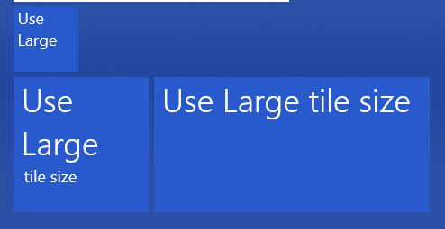

# TilesPlayer
This is a video player using Windows 10 live-tiles. Powered-by my [WinUIEssential](https://github.com/HO-COOH/WinUIEssentials).

## Usage
1. Build and run the project
2. Select a tile layout, then click `Pin tiles` and agree to pin all the tiles. 
  
3. Manually resize all the tiles to small size. In the start menu, and arrange them according to their number in row first order.
4. Load a video file.

If you are using a wrong tile size, the tile will warn you about this.


## Build
To build this, you need `opencv4`, and I recommend installing that with `vcpkg`
```
vcpkg install opencv4:x64-uwp
```

## Demo

[See here](https://www.bilibili.com/video/BV14a4y167d6/?vd_source=35c743cc22b85d14229aa9751ab0fc35)